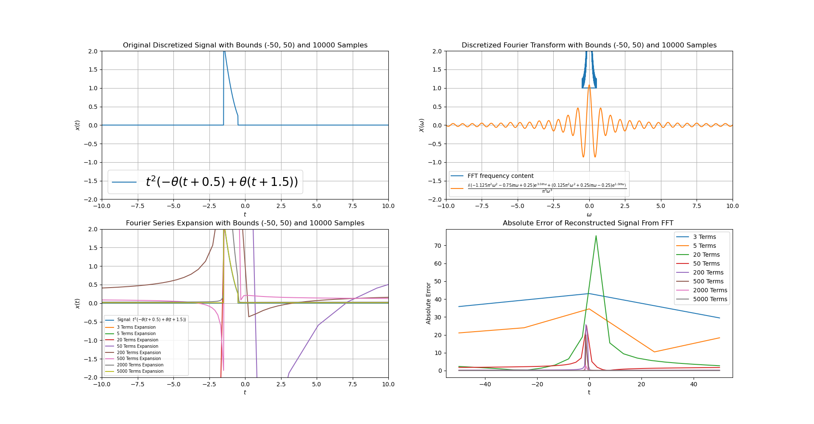

Something I whipped up for my EECE2520 final project. Calculates the FFT of the provided signal, which can be combination of custom defined functions (rectangular pulse, etc) and sympy functions. When possible, calculates the fourier transform of the signal. Then, the FFT is used to reconstruct the signal with a varying number of terms, showing the reconstruction and it's error.



# Installation/Dependecies:
```
git clone https://github.com/garylvov/Dependencies

pip install numpy scipy sympy matplotlib
```

# Running the program

In ```main.py```, you can define the signals you'd like to analyze as part of the ```signals_to_proc``` list.

```python3 main.py```